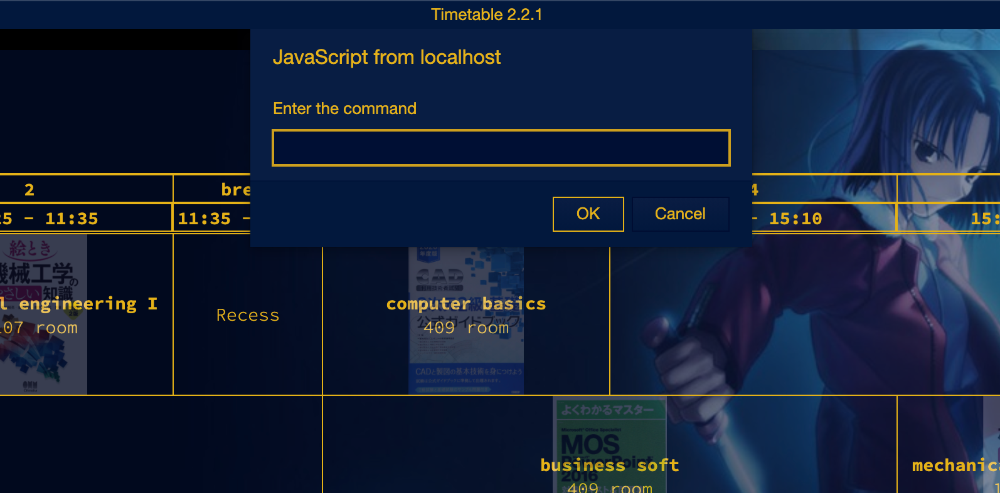

# Timetable

This is the timetable for the mechanical CAD design department.

## How to use this Timetable

<ol>
  <li>
    Download your favorite version of the zip file <a href="https://github.com/UtusemiUltimate-of-the-darkness/timetable/releases">here</a>. 
    Or run the following in a terminal:
    <pre><code>$ git clone https://github.com/UtusemiUltimate-of-the-darkness/timetable.git</code></pre>
  </li>
  <li>Unzip downloaded zip file on your favorite place.</li>
  <li>Open the html files in the unzipped folder in your browser.</li>
</ol>

### How to use command mode
<ol>
  <li>
    
Right click on the page.

    
You'll see a prompt like the one below.

    

      
    

  </li>
  <li>
    
Enter a command at the prompt. The list of commands is shown in the following table. command is case-insensitive.

    <table>
      <tr>
        <th>command</th>
        <th>description</th>
      </tr>
      <tr>
        <td>
          
'context'

          
'contextmenu'

          
'menu'

          
''

        </td>
        <td>Display context menu.</td>
      </tr>
      <tr>
        <td>
          
'display:block'

          
'body.display:block'

          
'timetable.display:block'

          
'.timetable.display:block'

          
'body.timetable.display:block'

        </td>
        <td>Display timetable.</td>
      </tr>
      <tr>
        <td>
          
'display:none'

          
'body.display:none'

          
'timetable.display:none'

          
'.timetable.display:none'

          
'body.timetable.display:none'

        </td>
        <td>Hide timetable (background appreciation mode).</td>
      </tr>
    </table>
  </li>
</ol>

### version info

#### <a href="https://github.com/UtusemiUltimate-of-the-darkness/timetable/tree/2.5.0">2.5.0</a>
<ul>
  <li>Delete subject CG application first. (4-6, 5-6)</li>
</ul>

#### <a href="https://github.com/UtusemiUltimate-of-the-darkness/timetable/tree/2.4.3">2.4.3</a>
<ul>
  <li>Change textbook of cell conputerBasics.</li>
</ul>

#### <a href="https://github.com/UtusemiUltimate-of-the-darkness/timetable/tree/2.4.2">2.4.2</a>
<ul>
  <li>Display the background of each cell when printing.</li>
  <li>Adjusting the height of each cell.</li>
</ul>

#### <a href="https://github.com/UtusemiUltimate-of-the-darkness/timetable/tree/2.4.1">2.4.1</a>
<ul>
  <li>Bug fixed (display text of wed4, thu2 and thu3).</li>
</ul>

#### <a href="https://github.com/UtusemiUltimate-of-the-darkness/timetable/tree/2.4.0">2.4.0</a>
<ul>
  <li>Add text to CADpractice(Ms. N.Ito).</li>
</ul>

#### <a href="https://github.com/UtusemiUltimate-of-the-darkness/timetable/tree/2.3.3">2.3.3</a>
<ul>
  <li>View limited users on smartphone and tablet.</li>
</ul>

#### <a href="https://github.com/UtusemiUltimate-of-the-darkness/timetable/tree/2.3.2">2.3.2</a>
<ul>
  <li>Print style settings.</li>
</ul>

#### <a href="https://github.com/UtusemiUltimate-of-the-darkness/timetable/tree/2.3.1">2.3.1</a>
<ul>
  <li>Changed room name to bold.</li>
  <li>Display teacher's name.</li>
  <li>Display textbooks and tools.</li>
</ul>

#### <a href="https://github.com/UtusemiUltimate-of-the-darkness/timetable/tree/2.3.0">2.3.0</a>
<ul>
  <li>Removed online timetable.</li>
  <li>Fixed the list of commands in README.</li>
</ul>

#### <a href="https://github.com/UtusemiUltimate-of-the-darkness/timetable/tree/2.2.5">2.2.5</a>
<ul>
  <li>Removed class start date for CG appication first.</li>
  <li>Fixed the list of commands in README.</li>
</ul>

#### <a href="https://github.com/UtusemiUltimate-of-the-darkness/timetable/tree/2.2.4">2.2.4</a>
<ul>
  <li>Extended command mode commands.</li>
</ul>

#### <a href="https://github.com/UtusemiUltimate-of-the-darkness/timetable/tree/2.2.3">2.2.3</a>
<ul>
  <li>Fixed the problem of switching the timetable display.</li>
  <li>Add display contextMenu command.</li>
</ul>

#### <a href="https://github.com/UtusemiUltimate-of-the-darkness/timetable/tree/2.2.2">2.2.2</a>
<ul>
  <li>delete room description on online timetable.</li>
  <li>Add teachers name on online timetable.</li>
</ul>

#### <a href="https://github.com/UtusemiUltimate-of-the-darkness/timetable/tree/2.2.1">2.2.1</a>
<ul>
  <li>Supports command operations</li>
  <li>Change term of th online timetable</li>
  <li>Change subject name ( toLowerCase ).
</ul>

#### <a href="https://github.com/UtusemiUltimate-of-the-darkness/timetable/tree/2.2.0">2.2.0</a>
<ul>
  <li>Add online timetable ( 1027-1102 )</li>
  <li>Change table position ( to center ) </li>
</ul>

#### <a href="https://github.com/UtusemiUltimate-of-the-darkness/timetable/tree/2.1.1">2.1.1</a>
<ul>
  <li>Add textbook image to timetable cell background</li>
</ul>

#### <a href="https://github.com/UtusemiUltimate-of-the-darkness/timetable/tree/2.1.0">2.1.0</a>
<ul>
  <li>Add background image</li>
  <li>language to English</li>
  <li>change text font</li>
</ul>

#### 2.0.0
<ul>
  <li>timetable of 2semester</li>
</ul>

